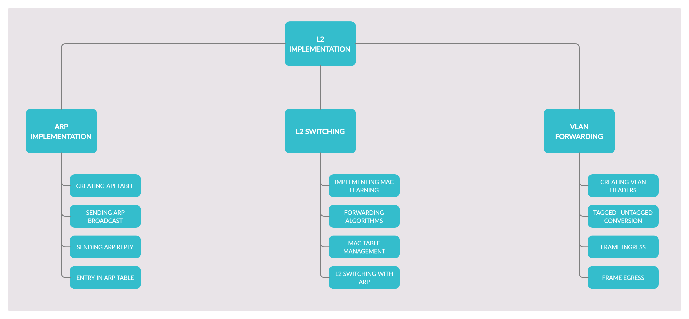

# L2-Emulator

This main objective of the project is to decipt the functionality of the DataLink Layer, also termed as Layer-2. 

Sub-objectives of the project are : 
* Developing a generic graph topology.
* Tackling the issues of thrashing, collision and reducing broadcast domain.
* Implementing ARP, L2 routing, MAC learning and L2 switching and VLAN Forwarding.

## Abstract

In today’s world, fast and efficient communication on the network between the sender and receiver is very important. For this communication, data is converted into packets and sent over the network using various routing algorithms. In a network or over multiple networks, routing refers to the process of determining a path for a packet to travel from. *L2 Routing is based on the concept of Data Link layer and happens when data is to be transferred between the same subnet.* In this project, we aim to implement the functionality of Data Link Layer like creating **ARP Tables, L2 Routing, MAC Learning, L2 Switching & implementing VLAN forwarding.**

***Keyword :*** *Network Routing, TCP/IP, Network Graph, ARP, L2 Routing, L2 Switching, Packet, Socket Programming, Topology, VLAN, MAC Learning*

## Aim

This project focuses on implementing **Layer 2 i.e. Data-Link Layer** of TCP/IP Stack. The project mainly focuses on Graph Data Structures highlighting the features of Generic Graph Topology. The project will use routers, switches, links as well as nodes to depict the overall functionality of network topology, the entire packet journey (on sending and receiving machines) through the Data Link Layer of TCP/IP Model along with a minimal use of Socket Programming will be shown in this project.

## Contributors

1. [Kshitiz Saini](https://github.com/kshitizsaini113)
2. [Saloni Saxena](https://github.com/SaloniSaxena01)
3. [Pratyusha Agarwal](https://github.com/pratyusha1098-pa)

---

Full documentation of the project is available under [Project Synopsis](Synopsis_Report/SynopsisReport.pdf)

---

The contribution guidelines are present [here](docs/CONTRIBUTING.md)

---

The project is licensed under [GNU General Public License](LICENSE) 
